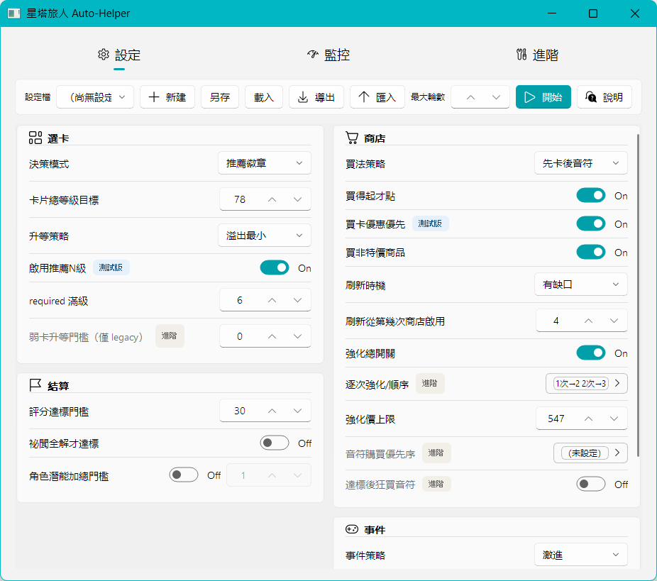

# 星塔旅人自動爬塔工具

> 用電腦視覺自動爬塔的桌面輔助程式。


## 專案簡介

**星塔旅人自動爬塔工具**是一款執行於 Windows 的桌面輔助程式,專為遊戲《星塔旅人》設計。它的運作流程是:

**擷取遊戲畫面 → EasyOCR + OpenCV 辨識當前狀態 → 有限狀態機(FSM)決策 → Win32 模擬點擊**

藉此自動化從編隊、快速戰鬥、潛能三選一、隨機事件到商店採購的完整探索流程。圖形介面以 PyQt5 + PyQt-Fluent-Widgets 打造,提供即時日誌與參數調整。本專案以技術交流與個人自動化研究為目的,實際使用前請務必閱讀文末的 [授權](#授權) 與 [免責聲明](#免責聲明)。

## 功能特色

- **全流程自動探索**:狀態機串接大廳、編隊、快速戰鬥、潛能選擇、隨機事件、商店等多個畫面,自動推進整輪探索。
- **視覺辨識層**:結合 EasyOCR 文字辨識與 OpenCV 模板 / 色相比對,辨識畫面狀態、按鈕與關鍵字。
- **可設定的決策引擎**:決策以**推薦判別**(讀畫面推薦徽章)為主,並可在 GUI 以**自訂預設(profiles)**客製選卡 / 事件 / 商店策略。
- **音符 / 協奏追蹤**:以白色內符號加色相辨識讀取秘紋啟動所需音符,輔助採購與決策。
- **攻略圖解析**:可從攻略截圖以 OCR 解析必拿 / 備選技能(CLI:`tools/parse_guide_image.py`);近期決策改以**推薦判別 + 自訂預設**為主,此功能暫時分割、尚未整合進 GUI。
- **現代化 GUI**:PyQt-Fluent-Widgets 介面,提供即時日誌監控與參數調整。
- **狀態機回放測試**:以截圖語料回放狀態機,便於除錯與回歸驗證。

## 預覽



> 圖為 GUI 設定頁(PyQt-Fluent-Widgets):選卡 / 結算 / 商店 / 事件四組可調參數。另有監控頁(即時狀態、流程進度、協奏音符)與進階頁(速度 / 感知 / 硬體)。

## 技術棧

本專案使用以下開源套件。各套件授權以上游實際授權為準,使用地方/用途由本專案實際程式碼決定。

| 套件 | 用途 | 授權 |
|---|---|---|
| [numpy](https://github.com/numpy/numpy) | 影像以 numpy 陣列表示與運算,貫穿視覺層(`vision/`)與視窗擷取(`utils/window_mgr.py`)。 | BSD-3-Clause |
| [opencv-python](https://github.com/opencv/opencv-python)(OpenCV) | 影像處理、模板比對、色彩空間轉換(`vision/matcher.py`、`vision/ocr_engine.py`、`utils/window_mgr.py`)。 | Apache-2.0 |
| [Pillow](https://github.com/python-pillow/Pillow) | 視窗擷取模組的影像處理(`utils/window_mgr.py`)。 | HPND(MIT-CMU 風格) |
| [pywin32](https://github.com/mhammond/pywin32) | Win32 視窗擷取與滑鼠 / 鍵盤模擬(`utils/window_mgr.py`、`utils/input_sim.py`)。 | PSF 授權 |
| [PyQt5](https://www.riverbankcomputing.com/software/pyqt/) | 圖形介面框架(`main_gui.py`、`gui/`)。 | GPL-3.0 或商用授權 |
| [PyQt-Fluent-Widgets](https://github.com/zhiyiYo/PyQt-Fluent-Widgets) | Fluent 風格 UI 元件(`main_gui.py`、`gui/app.py`、`gui/event_editor.py`)。 | GPL-3.0 或商用授權 |
| [EasyOCR](https://github.com/JaidedAI/EasyOCR) | 光學文字辨識(OCR)引擎(`vision/ocr_engine.py`)。 | Apache-2.0 |
| [zhconv](https://github.com/gumblex/zhconv) | 攻略圖解析時的繁簡中文轉換(`tools/parse_guide_image.py`)。 | MIT |

註:**PyQt5** 與 **PyQt-Fluent-Widgets** 為 **GPL-3.0**(強 copyleft)授權;本專案亦採 **GPL-3.0**,與之相容,詳見下方 [授權](#授權)。

## 快速開始

### 環境需求

- 作業系統:**Windows 10 / 11**
- **Python 3.8 或更新版本**
- 遊戲《星塔旅人》(視窗名稱 `StellaSora`)
- 以 **視窗模式(非全螢幕)** 執行遊戲
- 建議配備 NVIDIA 顯卡(EasyOCR 可使用 CUDA 加速,非必要)(但不開會很慢)
- 需要 **系統管理員權限** 執行(程式啟動時會檢查;遊戲與本程式需使用相同權限等級)

### 安裝

```bash
# 1. 取得原始碼
git clone https://github.com/<your-account>/<your-repo>.git
cd 星塔旅人

# 2. 建立並啟用虛擬環境
python -m venv .venv
.venv\Scripts\activate

# 3. 安裝相依套件
pip install -r requirements.txt
```

> 開發者另可安裝 `requirements-dev.txt`(包含 `pytest`)。

### 執行

**方式一:圖形介面(GUI)**

```bash
# 以系統管理員身分執行(右鍵 → 以系統管理員身分執行)
start_gui.bat
```

`start_gui.bat` 會在缺少權限時嘗試請求管理員權限,並使用 `.venv` 內的 Python 啟動 `main_gui.py`。

**方式二:命令列(CLI)**

```bash
python main.py                 # 使用預設 config.yaml
python main.py --config config.yaml
python main.py --dry-run       # 骨架測試模式,不進行真實點擊
python main.py --log-level DEBUG
```

> 執行前請確認遊戲已開啟並位於前台(本程式採用前台截圖)。

## 使用方式

1. 以 **視窗模式(非全螢幕)** 開啟《星塔旅人》。
2. 以 **系統管理員權限** 啟動本程式(GUI 或 CLI)。
3. 透過 `config.yaml` 調整行為,常用設定包含:
   - `bot.poll_interval`:每拍畫面掃描間隔(秒)。
   - `run.max_runs`:單次啟動的最大執行輪數。
   - `decision` / 商店與選卡相關區塊:設定必選與備選潛能、商店採購策略等。

> 詳細設定欄位與遊戲機制假設請參考 `config.yaml` 內的註解,以及 `docs/` 目錄下的文件。

## 發展藍圖

以下為規劃中的方向:

- 更加易用的GUI
- 決策邏輯提供更多選項
- 商店效率優化
- 完整全自動掛機的長時間穩定性驗證。
- 視覺辨識層的持續校準,降低狀態誤判。

> 規劃內容可能隨專案進展調整,排序不代表承諾的時程。

## 貢獻

回報問題、提出建議或送出 Pull Request 前,請先閱讀 [CONTRIBUTING.md](CONTRIBUTING.md) 了解開發環境設定、提交流程與程式風格。

## 安全

若您發現安全性問題,**請勿** 直接開公開 issue。請依照 [SECURITY.md](SECURITY.md) 的指引私下回報。

## 授權

本專案以 **GPL-3.0** 釋出,完整條款見 [LICENSE](LICENSE) 檔案。

採 GPL-3.0 是為了與相依的 **PyQt5** 與 **PyQt-Fluent-Widgets** 相容 —— 兩者皆為 **GPL-3.0**(強 copyleft)授權,散布整合它們的衍生作品時,整體須以相容於 GPL 的條款釋出,故本專案整體採 GPL-3.0。

## 開源專案使用

本專案使用下列開源專案:

- numpy
- opencv-python(OpenCV)
- Pillow
- pywin32
- PyQt5
- PyQt-Fluent-Widgets
- EasyOCR
- zhconv

## 免責聲明

本程式僅供**個人學習與研究**用途,採非侵入式設計(只截圖 / OCR + 外部鍵鼠模擬,不讀寫遊戲記憶體、不攔截封包、不修改檔案)。使用可能違反遊戲使用者協定,所有風險由使用者自行承擔。**完整免責條款見 [DISCLAIMER.md](DISCLAIMER.md)。**

---

*《星塔旅人》及相關名稱、素材的著作權屬於其各自權利人,本專案與遊戲官方無任何關聯。*
